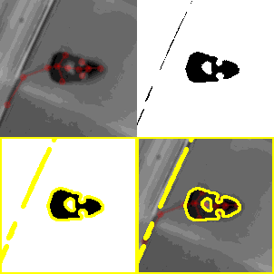
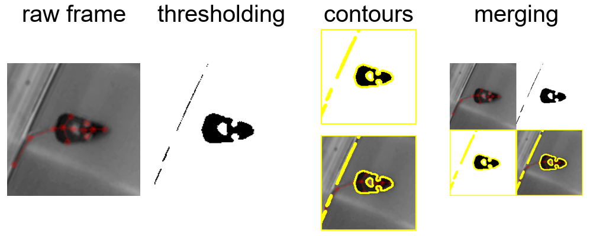

# Frame Pipeline

This is an object-oriented toolbox for exploratory video annotation. The pipeline consists of a number of classes that all operate as generators of modified frames or readers of local frame sources (currently videos, directories containing images, or frames in memory).

## General usage
You can instantiate a reader like this:
```python
video_source = Cv2VideoFrameReader(r"data\example_video.mp4")
```

This reader can then be iterated over...
```python
for frame_index, frame in video_source:
    pass
```

...or sliced...
```python
# grab the last 10 frames
extracted_frames = video_source[-10:]
```

... or piped into another generator.
```python
# add a little counter to the frame indicating the frame index
text_source = TextAnnotatedFramesGenerator(video_source, text_input=lambda x: dict(text=str(x)))
```

Evaluation of all changes only occurs when a frame is returned, e.g. during iteration or slicing.

## Text and tracking annotation
A little example with actual tracking data from our research project ["Social Context Restructures Behavioral Syntax in Mice"](https://github.com/Marti-Ritter/social-context-restructures-behavioral-syntax-in-mice).

```python
video_source = Cv2VideoFrameReader(r"data\example_video.mp4")
text_source = TextAnnotatedFramesGenerator(video_source, text_input=lambda x: dict(text=str(x)))
track0_source = KeypointInstanceAnnotatedFramesGenerator(text_source, track_df=track_df.loc["track_0"], skeleton_df=skeleton_df, color="red", alpha=0.2)
track1_source = KeypointInstanceAnnotatedFramesGenerator(track0_source, track_df=track_df.loc["track_1"], skeleton_df=skeleton_df, color="blue", alpha=0.2)
extracted_frames = track1_source[500:750]
```

The evaluated 250 frames (about 10 seconds) now contain two mice with overlaid keypoints.


As the shown keypoint annotators use a Matplotlib figure under the hood, one can easily use the parent class `PyplotAnnotatedFramesGenerator` to apply arbitrary Matplotlib functions to annotate frames. The primary drawback is a lack of speed currently, but there are otherwise no limits to what can be plotted. Anything that can be added to a Matplotlib figure can be plotted. For example, one could add a live heatmap of locations in the arena using the `ìmshow` function.

## Arbitrary frame modifications
It is far faster to apply general modifications, such as slicing, rotating, or thresholding to the frames using OpenCV. Again, there are no limits, anything that returns a valid frame can be applied to the frame generator and is only evaluated once the frames are returned.



## More visualization tools & examples
The full pipeline can also be visualized:


For more examples, check out the [notebook](./examples/FramePipelineExample.ipynb) in the examples subdirectory!
